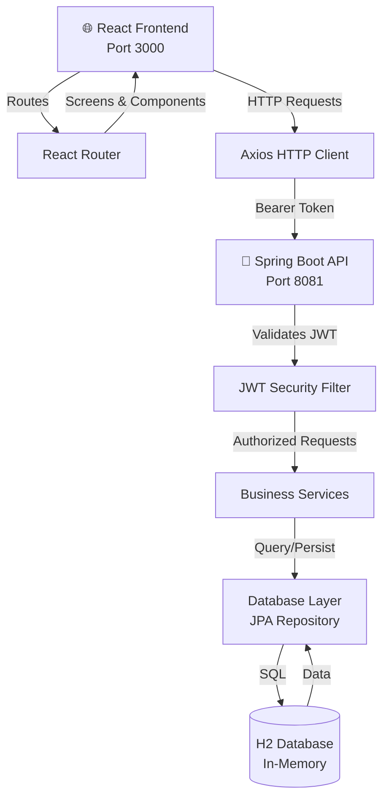
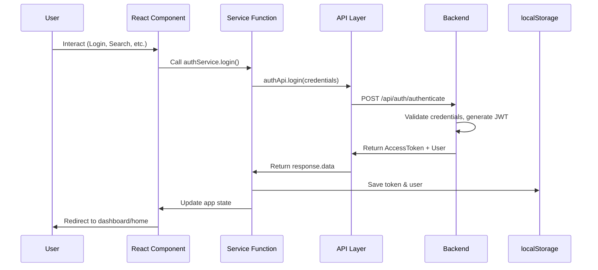
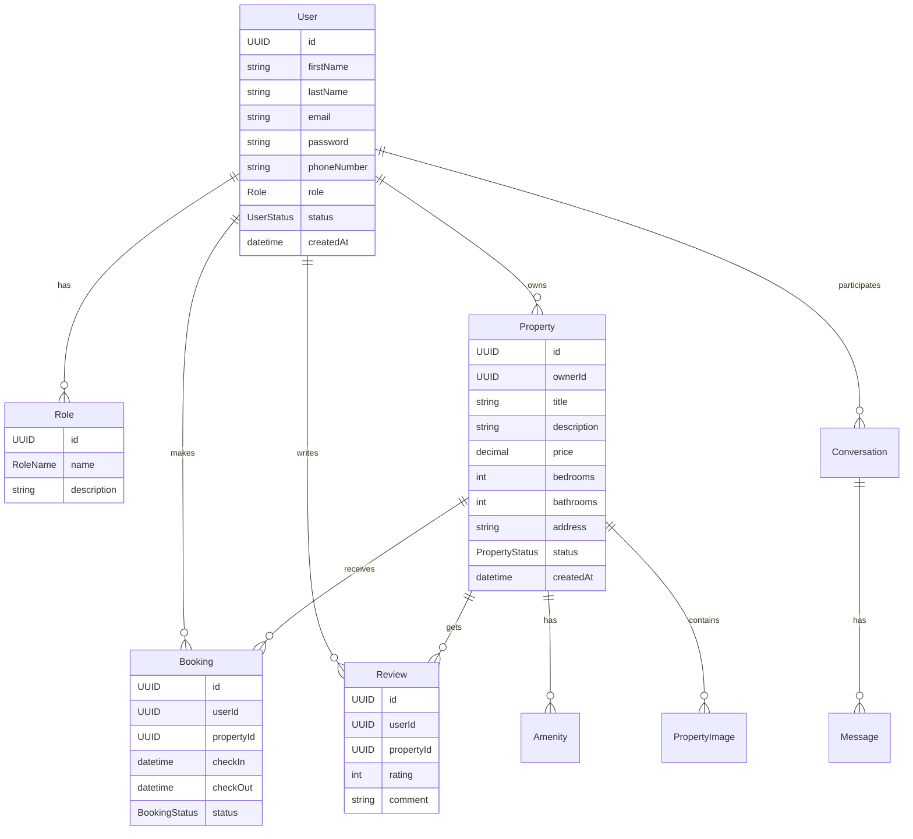
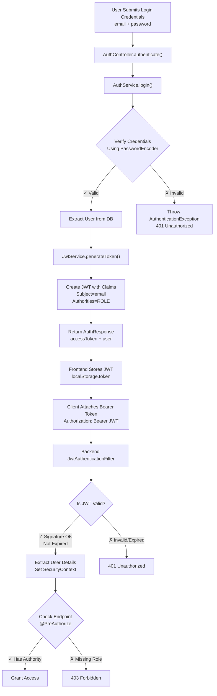
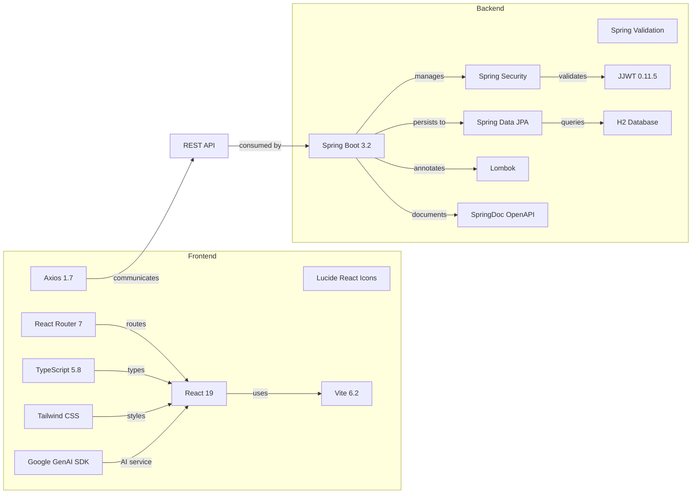

TerraRent is a full-stack property rental platform built with React + Vite (frontend) and Spring Boot (backend).

## Project Overview
- Frontend: React + TypeScript, Vite, Tailwind CSS
- Backend: Spring Boot (Java 17), Maven, H2 in-memory DB for development
- Auth: JWT-based authentication and role-based authorization (`ROLE_ADMIN`, `ROLE_LANDLORD`, `ROLE_RENTER`)

## Repository Layout
- Frontend root: React app (App.tsx, index.tsx, `components/`, `screens/`, `services/`, `api/`)
- Backend: `TerraRentBackend/` (Maven project with `src/main/java` and `src/main/resources`)
- Data seeding: `TerraRentBackend/src/main/resources/data.sql`

## Prerequisites
- Node.js (LTS recommended) and npm or yarn
- Java 17 and Maven (or use the included `mvnw` wrapper)

## Frontend — Setup & Run
1. Install dependencies:

```bash
npm install
```

2. Run dev server (Vite; default port 3000):

```bash
npm run dev
```

3. Build for production:

```bash
npm run build
```

Important frontend files:
- `vite.config.ts` — dev server port (3000) and environment handling for `GEMINI_API_KEY` and `VITE_API_URL`.
- `api/client.ts` — Axios instance; uses `import.meta.env.VITE_API_URL` or falls back to `http://localhost:8081/api`.

Environment variables (frontend):
- `VITE_API_URL` — API base URL (e.g. `http://localhost:8081/api`)
- `GEMINI_API_KEY` — optional, used by AI/gemini service

## Backend — Setup & Run
1. From `TerraRentBackend` directory run:

```powershell
# Windows
mvnw.cmd spring-boot:run

# or with Maven installed
mvn spring-boot:run
```

2. Or open the project in your IDE and run the Spring Boot application (Java 17).

Key backend details:
- `pom.xml` — Maven configuration, dependencies include Spring Boot starters and H2 for development
- `src/main/resources/application.yml` — server port (8081), H2 config, and default JWT settings
- `src/main/resources/data.sql` — seeds `roles` and some initial data

By default the backend runs on `http://localhost:8081` and serves API at `http://localhost:8081/api`.

## Authentication & Security
- JWT utilities are in `com.terrarent.security` (e.g., `JwtService`, `JwtAuthenticationFilter`).
- `SecurityConfig` restricts endpoints:
  - `/api/admin/**` requires `ROLE_ADMIN`
  - `/api/landlord/**` requires `ROLE_LANDLORD` or `ROLE_ADMIN`
  - `/api/renter/**` requires `ROLE_RENTER` or `ROLE_ADMIN`
  - Public endpoints: `/api/auth/**`, `/api/properties`, `/api/amenities`, Swagger endpoints, and H2 console
- CORS allowed origins (dev): `http://localhost:3000`, `http://localhost:3001`, `http://localhost:5173`

Frontend behavior:
- The frontend stores a JWT in `localStorage.token` and `api/client.ts` attaches `Authorization: Bearer <token>` when present.

## Data Seeding & Admin Access
- Roles are seeded in `data.sql` with fixed UUIDs (ADMIN ID `550e8400-e29b-41d4-a716-446655440001`).

If you get `403 Forbidden` on `/api/admin/**`, the token is valid but the user lacks `ROLE_ADMIN`. Quick fixes:
1. Open the H2 console: `http://localhost:8081/h2-console` (JDBC URL: `jdbc:h2:mem:terrarentdb`)
2. Confirm roles: `SELECT * FROM roles;`
3. Make a user an admin (replace email):

```sql
UPDATE users SET role_id = '550e8400-e29b-41d4-a716-446655440001' WHERE email = 'your_email@example.com';
```

Or insert an admin user into `users` with the ADMIN `role_id`. Passwords must be bcrypt-hashed to match `PasswordEncoder`.

## Swagger / API Docs
- springdoc-openapi is included. Swagger UI is usually available at `/swagger-ui.html` or `/swagger-ui/index.html` when the backend is running.

## Troubleshooting
- 403 on admin endpoints: confirm role in DB or create admin user.
- 401 Unauthorized: ensure `localStorage.token` contains a current JWT or re-login.
- CORS errors: confirm frontend origin is allowed in backend `CorsConfigurationSource`.

## Environment Variables Summary
- Frontend: `VITE_API_URL`, `GEMINI_API_KEY`
- Backend: `JWT_SECRET_KEY` (overrides default in `application.yml`), any DB settings if switching from H2 to PostgreSQL

---

## Project Architecture Overview

### System Architecture Diagram



### Frontend Component Tree

```
App.tsx (Router)
├── Layout (Main wrapper with navbar/sidebar)
│   ├── Public Screens
│   │   ├── HomePage
│   │   ├── SearchPage
│   │   ├── MapPage
│   │   ├── PropertyDetails
│   │   ├── AmenitiesPage
│   │   └── StaticPages (About, FAQ, etc.)
│   │
│   ├── Auth Screens
│   │   ├── AccountSelection
│   │   ├── SignupRenter / SignupLandlord
│   │   ├── Login
│   │   ├── VerifyEmail
│   │   ├── ForgotPassword
│   │   └── ResetPassword
│   │
│   ├── Renter Portal
│   │   ├── Dashboard
│   │   ├── SavedProperties
│   │   ├── RecentlyViewed
│   │   ├── Compare
│   │   ├── Booking
│   │   ├── Application
│   │   ├── ScheduleTour
│   │   ├── Chat
│   │   └── Negotiation
│   │
│   ├── Landlord Portal
│   │   ├── Dashboard
│   │   ├── Properties
│   │   ├── AddProperty
│   │   ├── EditProperty
│   │   ├── MediaManager
│   │   ├── Calendar
│   │   ├── Pricing
│   │   ├── Applications
│   │   └── Requests
│   │
│   └── Admin Portal
│       ├── Dashboard
│       ├── Users
│       ├── Properties
│       ├── Featured
│       ├── Verification
│       ├── Reports
│       └── Analytics
│
├── Common Components
│   ├── PropertyCard
│   ├── Layout (wrapper)
│   └── AIChatBot
│
└── AI Components
    └── AIChatBot (Gemini AI integration)
```

### Frontend Module Organization

| Module | Purpose | Key Files | Responsibilities |
|--------|---------|-----------|------------------|
| **API Layer** | HTTP communication | `api/client.ts`, `api/endpoints/*.ts` | Makes requests to backend, handles response/errors |
| **Services** | Business logic | `services/*/functions.ts`, `services/*/hooks.ts` | Auth flow, data fetching, state management |
| **Hooks** | React utilities | `hooks/*.ts` | Pagination, debounce, local storage, toggle, media query |
| **Context** | Global state | `context/AuthContext.tsx` | Authentication state across app |
| **Screens** | Page components | `screens/*/*.tsx` | Full page views for different roles |
| **Components** | Reusable UI | `components/*.tsx` | Shared UI elements (cards, layout, etc.) |
| **Types** | TypeScript definitions | `types/*.ts`, `api/types/*.ts` | Request/response models |
| **Utils** | Helper functions | `utils/*.ts` | Formatters, validators, storage helpers |

### Frontend Data Flow



### Backend Architecture

```
TerraRentBackend (Maven Project)
├── src/main/java/com/terrarent/
│   ├── controller/          # REST Endpoints (11 controllers)
│   ├── service/             # Business Logic (13 services)
│   ├── repository/          # Data Access Layer (JPA)
│   ├── entity/              # JPA Entities (Domain Models)
│   ├── dto/                 # Data Transfer Objects
│   ├── security/            # JWT & Auth
│   ├── config/              # Spring Configuration
│   └── exception/           # Custom Exceptions
│
└── src/main/resources/
    ├── application.yml      # Config (port, JWT, DB)
    ├── data.sql             # Initial data seeding
    └── schema.sql           # Database schema
```

### Backend API Routes & Endpoints

| Controller | Endpoint | Method | Auth | Purpose |
|------------|----------|--------|------|---------|
| **AuthController** | `/api/auth/register` | POST | ❌ | User registration |
| | `/api/auth/authenticate` | POST | ❌ | User login (returns JWT) |
| | `/api/auth/verify` | POST | ❌ | Email verification |
| | `/api/auth/resend-verification` | POST | ❌ | Resend verification code |
| **PropertyController** | `/api/properties` | GET | ❌ | List all properties (public) |
| | `/api/properties/{id}` | GET | ❌ | Get property details |
| **LandlordController** | `/api/landlord/dashboard/metrics` | GET | 🔒 | Dashboard stats |
| | `/api/landlord/properties` | GET | 🔒 | Get landlord's properties |
| | `/api/landlord/properties/{id}` | GET | 🔒 | Get specific property |
| | `/api/landlord/properties` | POST | 🔒 | Create new property |
| | `/api/landlord/properties/{id}` | PUT | 🔒 | Update property |
| | `/api/landlord/applications` | GET | 🔒 | View applications |
| **RenterController** | `/api/renter/dashboard/metrics` | GET | 🔒 | Renter dashboard |
| | `/api/renter/saved-properties` | GET/POST | 🔒 | Save/retrieve properties |
| | `/api/renter/applications` | POST | 🔒 | Submit application |
| | `/api/renter/bookings` | GET/POST | 🔒 | Booking management |
| **AdminController** | `/api/admin/dashboard/metrics` | GET | 👑 | Admin dashboard |
| | `/api/admin/users` | GET | 👑 | List all users |
| | `/api/admin/users/{id}/status` | PUT | 👑 | Update user status |
| | `/api/admin/properties` | GET | 👑 | List all properties |
| | `/api/admin/properties/{id}/status` | POST | 👑 | Approve/reject property |
| **AmenityController** | `/api/amenities` | GET | ❌ | List amenities |
| **BookingController** | `/api/bookings` | GET/POST | 🔒 | Booking management |
| **MessageController** | `/api/messages` | GET/POST | 🔒 | Messaging |
| **ReviewController** | `/api/reviews` | GET/POST | 🔒 | Reviews & ratings |

Legend: ❌ = Public, 🔒 = Authenticated, 👑 = Admin Only

### Backend Services & Responsibilities

| Service | Responsibilities | Key Methods |
|---------|------------------|------------|
| **AuthService** | User registration, login, JWT generation | `register()`, `login()`, `verifyEmail()`, `resendVerificationEmail()` |
| **PropertyService** | CRUD operations for properties, filtering | `getAllProperties()`, `getPropertyById()`, `createProperty()`, `updateProperty()` |
| **LandlordService** | Landlord-specific operations | `getLandlordDashboardMetrics()`, `getLandlordProperties()`, `getLandlordPropertyById()` |
| **RenterService** | Renter operations (bookings, applications, saved) | `saveProperty()`, `getBookings()`, `submitApplication()` |
| **AdminService** | Admin operations (user/property management) | `getAdminDashboardMetrics()`, `getAllUsers()`, `updateUserStatus()`, `updatePropertyStatus()` |
| **BookingService** | Booking lifecycle management | `createBooking()`, `cancelBooking()`, `updateBookingStatus()` |
| **ImageService** | Image upload/storage | `uploadImage()`, `getImage()` |
| **MessageService** | Messaging between users | `sendMessage()`, `getConversations()` |
| **ReviewService** | Reviews & ratings | `createReview()`, `getPropertyReviews()` |
| **UserService** | User profile management | `getUserById()`, `updateUser()`, `getUserByEmail()` |

### Database Schema Overview



### Authentication & Authorization Flow



### Dependency Graph



### Frontend Services Architecture

| Service Layer | Module | Functions | Inputs | Outputs |
|---------------|--------|-----------|--------|---------|
| **Auth** | `services/auth/` | `login()`, `register()`, `verifyEmail()`, `logout()`, `isAuthenticated()` | Credentials, email | JWT, user object |
| **Properties** | `services/properties/` | `searchProperties()`, `filterProperties()`, `getPropertyDetails()` | Filters, page, size | PropertyResponse[], pagination |
| **Landlord** | `services/landlord/` | `getDashboard()`, `getProperties()`, `addProperty()` | Property data, landlord ID | Property list, dashboard metrics |
| **Renter** | `services/renter/` | `saveProperty()`, `getApplications()`, `submitApplication()` | Property ID, booking data | Confirmation, application list |
| **Admin** | `services/admin/` | `getDashboard()`, `getUsers()`, `updateUserStatus()` | User ID, status | Users list, updated records |
| **Messaging** | `services/messaging/` | `sendMessage()`, `getConversations()` | Message text, user IDs | Message, conversation list |

### Key Features & Implementation

| Feature | Frontend Component | Backend Service | Auth Required | Role Required |
|---------|-------------------|-----------------|---------------|---------------|
| Property Search | SearchPage | PropertyService | ❌ | - |
| Property Listing | PropertyCard | PropertyService.getAll() | ❌ | - |
| User Registration | SignupRenter/Landlord | AuthService.register() | ❌ | - |
| Email Verification | VerifyEmail | AuthService.verifyEmail() | ❌ | - |
| Landlord Dashboard | LandlordDashboard | LandlordService.getLandlordDashboardMetrics() | ✅ | LANDLORD |
| Add Property | AddProperty | PropertyService.createProperty() | ✅ | LANDLORD |
| Renter Dashboard | RenterDashboard | RenterService.getDashboardMetrics() | ✅ | RENTER |
| Save Property | SavedProperties | RenterService.saveProperty() | ✅ | RENTER |
| Booking Management | Booking | BookingService.createBooking() | ✅ | RENTER |
| Admin User Management | AdminUsers | AdminService.updateUserStatus() | ✅ | ADMIN |
| Property Approval | AdminProperties | AdminService.updatePropertyStatus() | ✅ | ADMIN |
| Messaging | Chat | MessageService.sendMessage() | ✅ | RENTER/LANDLORD |
| Reviews | PropertyDetails | ReviewService.createReview() | ✅ | RENTER |

### Environment Variables Quick Reference

```bash
# Frontend (.env)
VITE_API_URL=http://localhost:8081/api
GEMINI_API_KEY=your_gemini_api_key_here

# Backend (application.yml or env vars)
JWT_SECRET_KEY=aSuperSecretKeyForTerraRentApplicationWhichIsLongEnoughForHS256Algorithm
SPRING_DATASOURCE_URL=jdbc:h2:mem:terrarentdb
SPRING_JPA_HIBERNATE_DDL_AUTO=update
```

### Technology Stack Summary

**Frontend:**
- **Framework**: React 19 + TypeScript
- **Build Tool**: Vite 6
- **HTTP Client**: Axios
- **Styling**: Tailwind CSS
- **Routing**: React Router 7
- **Icons**: Lucide React
- **AI**: Google GenAI SDK
- **State Management**: React Context API, localStorage

**Backend:**
- **Framework**: Spring Boot 3.2 (Java 17)
- **Build Tool**: Maven
- **Database**: H2 in-memory (development)
- **Security**: Spring Security + JWT (JJWT 0.11.5)
- **ORM**: Spring Data JPA + Hibernate
- **API Documentation**: SpringDoc OpenAPI (Swagger)
- **Code Generation**: Lombok
- **Validation**: Jakarta Validation

---
